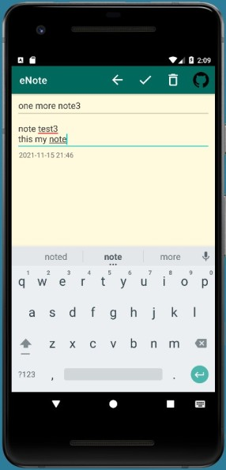
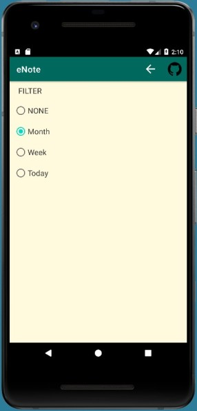

Easy notepad eNote

----
Lesson theme:
- SQLite, DatabaseHelper

Features of the program code:
- Single activity
- Working with SQL via DatabaseHelper
- SimpleCursorAdapter
- Items sorting and filtering
- Change the color of the menu item icon when setting the filter
- Keep text cursor position or selected text on rotation 

[21.11.21]